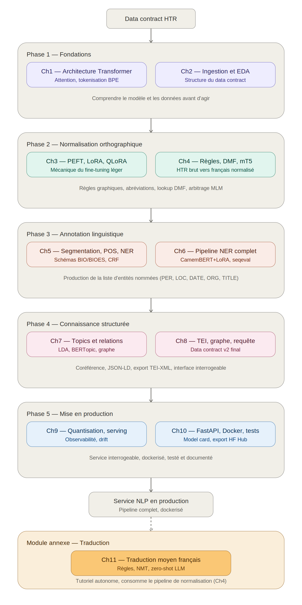

# Guide synthétique — Du data contract HTR au service NLP en production

**Document de référence — Module NLP · Master Data/IA · MD5 Volet 2 · 2026**

## Objet de ce document

Les onze chapitres du module ont été présentés et travaillés séparément, chacun avec son propre matériel pédagogique. Ce guide retrace, sans rentrer dans le détail technique déjà couvert ailleurs, l'enchaînement complet du pipeline : ce que chaque étape reçoit en entrée, ce qu'elle produit en sortie, et où trouver l'explication complète dans les supports du cours.

Le diagramme ci-dessus pose la structure d'ensemble. Six blocs : fondations, normalisation, annotation linguistique, connaissance structurée, mise en production, et un module annexe de traduction qui se greffe sur la sortie de la normalisation (Chapitre 4) sans appartenir au tronc principal du pipeline.

## Phase 1 — Fondations (Chapitres 1 et 2)

### Étape 1.1 — Comprendre le modèle qu'on va utiliser

Avant de toucher aux données, il faut comprendre l'architecture qui sous-tend tous les modèles employés ensuite : CamemBERT pour la NER, mT5 pour la normalisation, Opus-MT pour la traduction. Le Chapitre 1 explique le mécanisme d'attention, l'encodage positionnel, et la tokenisation par sous-mots — avec une attention particulière à la fragmentation BPE des formes médiévales non standardisées (*roys* découpé en deux tokens, *paloys* en trois), qui justifie pourquoi la normalisation orthographique en amont (Phase 2) réduit la charge cognitive imposée aux modèles en aval.

→ *Chapitre 1, §2 à §5 pour le mécanisme d'attention et l'architecture ; §7 pour la tokenisation et son impact spécifique sur le moyen français.*

### Étape 1.2 — Recevoir et qualifier le data contract HTR

Le pipeline démarre avec la réception du data contract produit par le Volet 1 (HTR). Chaque ligne du corpus arrive avec sa transcription brute, son `polygon_ref` (ancrage spatial vers le manuscrit), un score de `confidence`, et un indicateur `needs_review`. Avant toute transformation, il faut comprendre la structure de ce contrat et effectuer une analyse exploratoire : distribution des longueurs, taux de lignes à réviser, distribution des scores de confiance par type de document.

→ *Chapitre 2, §1 pour la structure du data contract et ses garanties ; §2 pour l'analyse des lignes `needs_review` ; §3 pour l'EDA complète (distributions, histogrammes, taux de caractères critiques).*

**Sortie de la Phase 1 :** aucune transformation des données — cette phase est une phase de compréhension. Le data contract HTR reste inchangé, mais vous savez désormais ce qu'il contient et où sont ses points faibles.

## Phase 2 — Normalisation orthographique (Chapitres 3 et 4)

### Étape 2.1 — Apprendre la mécanique du fine-tuning léger

Le Chapitre 3 est un détour méthodologique nécessaire avant d'attaquer la normalisation : il explique PEFT, LoRA et QLoRA — comment adapter un modèle pré-entraîné à une tâche spécifique en n'entraînant qu'une fraction de ses paramètres. Cette mécanique sera réutilisée deux fois : pour le fine-tuning de mT5 sur la normalisation (Étape 2.3 ci-dessous) et pour le fine-tuning de CamemBERT sur la NER (Phase 3).

→ *Chapitre 3, §2 pour la décomposition de rang faible de LoRA ; §3 pour les hyperparamètres (rang r, modules cibles) ; §4 pour QLoRA et la quantisation NF4.*

### Étape 2.2 — Règles graphiques et lexique DMF

La normalisation proprement dite commence par une étape déterministe : résoudre les alternances graphiques systématiques (u/v, i/j), les terminaisons variables (-oit/-ait), et les abréviations scribales (tilde de nasalité, signes suprascripts) par des règles documentées. Cette étape couvre 60 à 75 % des divergences entre transcription brute et forme normalisée sans recourir à aucun modèle neural. Le Dictionnaire du Moyen Français (DMF) et son lemmatiseur LGeRM complètent les règles pour les formes non couvertes.

→ *Chapitre 4, §1 pour la linguistique du moyen français nécessaire ; §2 pour le module de règles graphiques ; §3 pour l'intégration du DMF et de LGeRM ; §4 pour la résolution des abréviations.*

### Étape 2.3 — Arbitrage par confiance et fine-tuning mT5

Pour les positions où le HTR hésite entre deux caractères, un arbitrage par pseudo-log-vraisemblance sous CamemBERT permet de choisir l'alternative la plus probable dans son contexte. Les paires (transcription brute, forme normalisée) ainsi produites alimentent ensuite le fine-tuning LoRA de mT5-small, qui généralise au-delà de ce que les règles couvrent.

→ *Chapitre 4, §5 pour l'arbitrage MLM et la comparaison des trois stratégies (confiance seule, MLM seul, combinée) ; §6 pour la construction des paires d'entraînement et le fine-tuning mT5 ; §7 pour la traçabilité (`CONVENTIONS_NLP.md`, journal d'expériences).*

**Sortie de la Phase 2 :** le data contract enrichi du champ `normalized` — la forme en français moderne standardisé de chaque ligne, avec un CER typiquement réduit de 50 à 60 % par rapport à la transcription brute.

## Phase 3 — Annotation linguistique et NER (Chapitres 5 et 6)

### Étape 3.1 — Segmentation, POS-tagging et schémas d'annotation NER

Sur le texte normalisé, deux opérations préparatoires précèdent l'extraction d'entités : la segmentation en mots (non trivial sur manuscrits où les espacements sont irréguliers) et l'étiquetage morphosyntaxique (POS-tagging et lemmatisation) via `pie-extended` ou Stanza `frm`. En parallèle, ce chapitre fixe le schéma d'annotation NER — BIO ou BIOES selon le besoin de précision — et explique l'architecture de classification de tokens au-dessus de CamemBERT, ainsi que la mesure de l'accord inter-annotateurs (IAA) qui borne la performance atteignable.

→ *Chapitre 5, §1 pour la segmentation ; §2 pour le POS-tagging et la lemmatisation ; §3 pour les schémas BIO/BIOES ; §4 pour l'architecture de classification ; §5 pour l'IAA.*

### Étape 3.2 — Constitution du corpus et fine-tuning CamemBERT-NER

La constitution du corpus d'entraînement combine annotation par gazetier (supervision faible) et validation humaine. Le fine-tuning de CamemBERT avec LoRA produit le modèle de classification de tokens proprement dit. L'annotation POS et la lemmatisation sont exécutées en parallèle sur le même corpus pour enrichir le data contract.

→ *Chapitre 6, §1 pour la stratégie de constitution du corpus (gazetier, weak supervision) ; §2 pour le fine-tuning CamemBERT+LoRA ; §3 pour l'intégration pie-extended/Stanza.*

### Étape 3.3 — Évaluation et production de la liste d'entités

L'évaluation s'effectue avec seqeval au niveau des spans (pas des tokens), produisant un F1 micro et macro par type d'entité. C'est à cette étape précise que le pipeline produit son livrable central : la liste structurée des entités nommées (`ner_spans`), chacune avec ses offsets caractères, son type (PER, LOC, DATE, ORG, TITLE), et sa traçabilité vers la ligne source.

→ *Chapitre 6, §4 pour l'évaluation seqeval complète, le tableau de métriques par type, et la matrice de confusion.*

**Sortie de la Phase 3 :** le data contract enrichi des champs `ner_spans`, `pos_tags`, `lemmas` — c'est le point d'arrêt explicite que vous aviez initialement fixé pour ce guide, et c'est aussi le palier intermédiaire (data contract v1 enrichi) sur lequel s'appuie toute la suite du pipeline.

## Phase 4 — Connaissance structurée (Chapitres 7 et 8)

### Étape 4.1 — Modélisation thématique et extraction de relations

Une fois les entités extraites, les lignes sont agrégées en documents (pages, actes) pour permettre la modélisation thématique — LDA dans sa version classique, BERTopic pour les corpus courts où les sacs de mots sont trop creux. En parallèle, des règles syntaxiques simples extraient des triplets de relations entre entités (PER porte_titre TITLE, PER réside_à LOC, PER agit_lors_de DATE).

→ *Chapitre 7, §1 pour la modélisation thématique (LDA puis BERTopic) ; §2 pour l'extraction de relations ; §3 pour la première construction du graphe de connaissances.*

### Étape 4.2 — Coréférence, graphe final et export TEI

Le Chapitre 8 referme le cycle de constitution de la base de connaissances : résolution de coréférence par règles pour fusionner les mentions d'une même entité, construction du graphe de connaissances définitif (NetworkX puis export JSON-LD), export TEI-XML acte par acte avec ancrage `facs` vers le manuscrit, et interface de requête minimale sur l'ensemble.

→ *Chapitre 8, §1 pour BERTopic sur corpus agrégé ; §2 pour les relations PER–LOC–DATE ; §3 pour la coréférence ; §4 pour le graphe final ; §5 pour l'export TEI ; §6 pour l'interface de requête.*

**Sortie de la Phase 4 :** le data contract version 2 — schéma complet incluant `topics`, `relations`, `coref_chain`, `graph_node_id`, `tei_ref` — plus les artefacts dérivés (`knowledge_graph.jsonld`, fichiers TEI-XML par acte).

## Phase 5 — Mise en production (Chapitres 9 et 10)

### Étape 5.1 — Optimisation du modèle pour le déploiement

Avant de packager quoi que ce soit, les modèles entraînés (CamemBERT-NER, mT5-normalisation) doivent être optimisés : quantisation (INT8 dynamique en première intention, GPTQ/AWQ/NF4 pour les cas plus contraints), éventuellement distillation, et choix d'un serveur d'inférence adapté au profil de trafic réel du projet — pour une API patrimoniale à faible trafic, la priorité va à la traçabilité plutôt qu'au débit brut.

→ *Chapitre 9, §1 pour les méthodes de quantisation ; §2 pour la distillation ; §3 pour le choix du serving (FastAPI, ONNX Runtime, vLLM/TGI) ; §6 pour la discussion spécifique aux humanités numériques (traçabilité vs throughput).*

### Étape 5.2 — Observabilité et garde-fous de production

Tout déploiement requiert un dispositif de surveillance : logging structuré des inférences, détection de drift conceptuel par divergence de Jensen-Shannon sur la distribution des types d'entités, et dashboard de métriques de latence (p50, p99).

→ *Chapitre 9, §4 pour les métriques de latence et débit ; §5 pour l'observabilité et la détection de drift.*

### Étape 5.3 — Packaging, tests et documentation finale

Le TP final assemble tous les éléments précédents en un livrable déployable : mesure de la dégradation F1 après quantisation, benchmark de latence avant/après, application FastAPI exposant `/analyze` et `/transcribe`, Dockerfile multi-stage reproductible, suite pytest en quatre fichiers (schéma, non-régression, latence, invariants), model card documentant les limitations, et export optionnel vers HuggingFace Hub.

→ *Chapitre 10, §1 pour la quantisation et l'évaluation F1 post-quantisation ; §2 pour le benchmark de latence ; §3 pour FastAPI et Docker ; §4 pour la suite pytest ; §5 pour la model card et les documents de livraison.*

**Sortie de la Phase 5 :** un service NLP conteneurisé, documenté, testé, exposant le pipeline complet (normalisation + NER) derrière une API REST versionnée et traçable jusqu'au `split_hash` des données d'entraînement.

## Module annexe — Traduction automatique (Chapitre 11)

Ce module ne fait pas partie du tronc principal du pipeline ; il consomme la sortie de la Phase 2 (texte normalisé) pour une tâche distincte — traduire le moyen français vers le français moderne, plutôt que d'en extraire des entités. Il est traité à part dans le cours parce qu'il n'a pas été couvert en séance et qu'il pose un problème différent : la rareté des corpus parallèles, les faux amis sémantiques (*liez* signifiant *libres*, pas *liés*), et l'absence de solution de production satisfaisante (l'option la plus performante, le LLM zero-shot, est délibérément écartée pour des raisons de reproductibilité).

→ *Chapitre 11, §1 pour la problématique spécifique ; §3 pour l'approche par règles et lexiques (DMF→TLFi) ; §4 pour le fine-tuning NMT (Opus-MT, mBART-50) ; §5 pour l'évaluation (BLEU, chrF, jugement humain) ; §6 pour la démonstration zero-shot LLM et ses limites en production.*

## Tableau récapitulatif : un coup d'œil sur tout le pipeline

| Phase | Chapitres | Entrée | Sortie | Livrable caractéristique |
|---|---|---|---|---|
| 1. Fondations | 1, 2 | Data contract HTR brut | Compréhension qualifiée du corpus | Rapport EDA |
| 2. Normalisation | 3, 4 | `transcription` brute | `normalized` | `CONVENTIONS_NLP.md` |
| 3. Annotation NER | 5, 6 | `normalized` | `ner_spans`, `pos_tags`, `lemmas` | Modèle CamemBERT+LoRA, rapport seqeval |
| 4. Connaissance | 7, 8 | Data contract v1 enrichi | `topics`, `relations`, `graph_node_id` | `knowledge_graph.jsonld`, TEI-XML |
| 5. Production | 9, 10 | Modèles + data contract v2 | Service déployé | Image Docker, model card |
| Annexe Traduction | 11 | `normalized` | Traduction française moderne | Modèle NMT fine-tuné |

*Document rédigé pour le Master Data/IA · Module NLP · MD5 Volet 2 · 2026. Ce guide est un index de navigation, pas un substitut aux chapitres : chaque renvoi pointe vers la section qui contient l'explication complète, le code de référence, et les exemples linguistiques associés.*

\newpage

